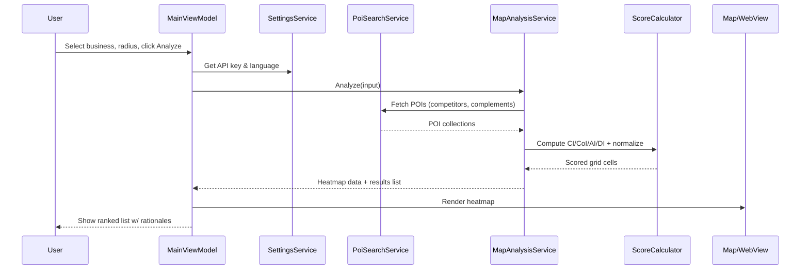
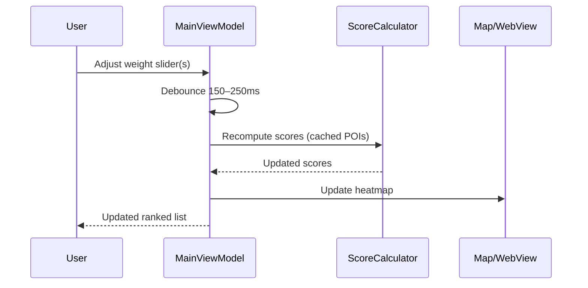

# VenueIQ Architecture Document

## 1. Introduction

This document defines the complete architecture for **VenueIQ**, a bilingual (**Serbian Latin / English**) .NET MAUI (mobile + desktop) application that helps users identify optimal business locations in Serbia using **Azure Maps**. It aligns with the PRD (prd.md) and is optimized for rapid MVP delivery with professional extensibility.

**Relationship to Frontend Architecture:** VenueIQ is a client-only app (no custom backend in MVP). The MAUI app uses Azure Maps Web control (via WebView) and REST APIs for POI search. Future server components can be added without breaking the client boundary.

---

## 2. High Level Architecture

### 2.1 Technical Summary
- **Architecture Style:** Client-first mobile/desktop app with direct integration to Azure Maps REST + Web control (WebView).  
- **Key Components:** View Layer (XAML pages), ViewModels (MVVM), Services (`MapAnalysisService`, `PoiSearchService`, `ScoreCalculator`, `ExportService`, `LocalizationService`, `SettingsService`), Infra (SecureStorage, Preferences).  
- **Core Patterns:** MVVM, Dependency Injection, immutable DTOs, async/await with cancellation, debounced computations.  
- **Primary Tech:** .net 9 MAUI, Azure Maps REST (Search), Azure Maps Web Control heatmap, QuestPDF/Syncfusion for PDF, MAUI Graphics for PNG/JPG.  
- **Bilingual UX:** Serbian Latin default (`sr-Latn`), English toggle; RESX resources and culture switching.

### 2.2 High Level Overview
- **Monorepo/Repo:** Single app repository (monoproject).  
- **Flow:** User enters inputs → app fetches POIs from Azure Maps → samples grid/hex points → computes CI/CoI/AI/DI → renders heatmap and ranked list → optional export (image/PDF).  
- **Decisions:** Client-only for MVP; no server latency; caching in-memory; live weight sliders drive recomputation without additional network calls when possible.

### 2.3 High Level Project Diagram (Mermaid)
```mermaid
graph TD
  U[User] -->|Inputs| VM[MainViewModel]
  VM --> SET[SettingsService (SecureStorage/Preferences)]
  VM --> L10N[LocalizationService (RESX)]
  VM --> SVC[MapAnalysisService]
  SVC --> POI[PoiSearchService]
  POI -->|REST| AZ[Azure Maps Search API]
  SVC --> SCORE[ScoreCalculator]
  SCORE --> HEAT[HeatmapData]
  VM --> MAP[Azure Maps Web Control (WebView)]
  VM --> LIST[Results List]
  VM --> EXP[ExportService (PNG/JPG/PDF)]
  HEAT --> MAP
  HEAT --> LIST
```

---

## 3. Architectural & Design Patterns

- **MVVM** for UI separation and testability.  
- **Dependency Injection** via `MauiProgram` (`IServiceCollection`).  
- **Repository/Service** abstraction for POI access (swappable if Google Places or server is added later).  
- **Normalization & Scoring** in `ScoreCalculator` (pure functions; unit-testable).  
- **Debounce + CancellationTokens** for repeated compute during slider changes.  
- **Resilience:** Retry w/ backoff on transient network failures (simple).

---

## 4. Tech Stack

### 4.1 Cloud Infrastructure
- **Provider:** Microsoft Azure  
- **Key Services:** Azure Maps (Search REST, Web Control)  
- **Regions:** EU region preferred for lower latency (e.g., West Europe)

### 4.2 Technology Stack Table
| Category | Technology | Version | Purpose | Rationale |
|---|---|---|---|---|
| Language | C# | 12 | App code | Modern features, performance |
| Runtime | .NET | 9.0.x | Cross-platform MAUI | LTS, perf |
| Framework | .NET MAUI | 8.x | Cross-platform UI | Single codebase |
| Mapping UI | Azure Maps Web Control | latest | Heatmap render | Mature heatmap, webview |
| Mapping REST | Azure Maps Search API | v1 | POI/category search | Category filters, language |
| PDF Export | QuestPDF **or** Syncfusion.Pdf | latest | Results report | Reliable PDF generation |
| Image Export | MAUI Graphics | n/a | Map viewport snapshot overlay | No extra dependency |
| DI | Built-in `Microsoft.Extensions.DependencyInjection` | latest | Composition | Standard |
| JSON | System.Text.Json | latest | (De)serialization | Fast, built-in |
| Logging | Microsoft.Extensions.Logging | latest | App logs | Unified abstractions |

> Pin exact versions in `Directory.Packages.props` once NuGet libs are finalized.

---

## 5. Data Models

### 5.1 Core DTOs
```csharp
public record BusinessType(string Id, string DisplayName, string[] CategoryIds, string[] ComplementCategoryIds);

public record AnalysisInput(
    double CenterLat,
    double CenterLng,
    int RadiusMeters,
    string BusinessTypeId,
    double WCompetition, double WComplements, double WAccessibility, double WDemand);

public record CellScore(
    double Lat, double Lng,
    double Score, double CI, double CoI, double AI, double DI,
    IReadOnlyList<string> TopFactors);

public record ResultItem(
    double Lat, double Lng,
    double Score,
    IReadOnlyList<string> Rationale,
    IReadOnlyList<PoiSummary> NearestCompetitors,
    IReadOnlyList<PoiSummary> NearestComplements);

public record PoiSummary(string Name, string Category, double DistanceMeters, double Lat, double Lng);
```

### 5.2 Category Mapping
`Assets/categories.serbia.json` maps dropdown items → Azure Maps category arrays for **Coffee, Pharmacy, Grocery, Fitness, Kids Services** (extensible).

---

## 6. Components

### 6.1 Services
- **SettingsService**: API key, language, last-used weights/radius (`SecureStorage` + `Preferences`).  
- **LocalizationService**: RESX resource manager; sets `CultureInfo("sr-Latn")` default; supports `"en"`.  
- **PoiSearchService**: Wraps Azure Maps Search REST (category search). Adds `language=sr-Latn` when Serbian active.  
- **MapAnalysisService**: Orchestrates POI fetch per category, creates sampling grid/hex within radius, transforms to features, requests minimal data; hands off to scoring.  
- **ScoreCalculator**: Pure methods for CI/CoI/AI/DI + normalization and final score. Distance-decay kernels: `exp(-d/300)` for competitors, `exp(-d/200)` for complements.  
- **ExportService**: 
  - **PNG/JPG** map overlay export: capture current WebView frame + optional overlay using MAUI Graphics (or inject a JS helper for DOM-to-canvas inside the map; fallback to native snapshot).  
  - **PDF**: table of results + mini-map thumbnails (request static image tiles for each location or render local snapshot), rationale bullets, metadata, timestamp.  

### 6.2 ViewModels (key)
- **MainViewModel**: Inputs (business type, radius, weights), Analyze command, bindable heatmap/list.  
- **SettingsViewModel**: API key (masked), Language toggle, Test Connection command.  
- **ResultsViewModel**: Wraps `ObservableCollection<ResultItem>`, handles item selection → centers map.

### 6.3 Views (XAML Pages)
- **StartupPage** (API key prompt if missing)  
- **MainPage** (Map + inputs panel + advanced sliders + results list)  
- **SettingsPage** (API key mgmt, language)

---

## 7. External APIs (Azure Maps)

### 7.1 Search (POI) — Category-based
- **Endpoint:** `GET https://atlas.microsoft.com/search/poi/category/json`  
- **Params:** `api-version=1.0`, `subscription-key={key}`, `lat`, `lon`, `radius`, `categorySet`, `language=sr-Latn|en`, `limit`, `view=Auto`  
- **Auth:** Subscription key in query (MVP)  
- **Rate/Quotas:** Observe free/paid tier limits; backoff + user messaging on throttling.

### 7.2 Static Map (optional for thumbnails)
- **Endpoint:** `GET /map/static/png` for small preview images in PDF (if used).

**Integration Notes:**  
- Batch queries per tile/ring to respect limits.  
- Cache per `BusinessTypeId + center + radius` for session-lifetime to reduce calls.  
- When weights change, recompute locally (no new REST calls).

---

## 8. Core Workflows

### 8.1 Analyze Flow (Sequence)


### 8.2 Weight Change Flow


### 8.3 Export Flows
- **PNG/JPG Map-only:** snapshot WebView + overlay mask (no list).  
- **PDF Results:** list with per-item map preview and rationale bullets.

---

## 9. Source Tree

```text
venueiq/
├── App.xaml / App.xaml.cs
├── Resources/
│   └── Strings/
│       ├── AppResources.resx
│       └── AppResources.sr-Latn.resx
├── Assets/
│   └── categories.serbia.json
├── Views/
│   ├── StartupPage.xaml
│   ├── MainPage.xaml
│   └── SettingsPage.xaml
├── ViewModels/
│   ├── StartupViewModel.cs
│   ├── MainViewModel.cs
│   └── SettingsViewModel.cs
├── Services/
│   ├── SettingsService.cs
│   ├── LocalizationService.cs
│   ├── PoiSearchService.cs
│   ├── MapAnalysisService.cs
│   ├── ScoreCalculator.cs
│   └── ExportService.cs
├── Controls/
│   └── MapWebView.xaml(.cs)       # WebView host + JS bridge
├── Models/
│   ├── Dtos.cs
│   └── Enums.cs
├── MauiProgram.cs                 # DI registrations
└── Directory.Packages.props       # pinned versions
```

**DI Registration (MauiProgram.cs snippet)**
```csharp
builder.Services.AddSingleton<SettingsService>();
builder.Services.AddSingleton<LocalizationService>();
builder.Services.AddSingleton<PoiSearchService>();
builder.Services.AddSingleton<MapAnalysisService>();
builder.Services.AddSingleton<ScoreCalculator>();
builder.Services.AddSingleton<ExportService>();

builder.Services.AddTransient<StartupViewModel>();
builder.Services.AddTransient<MainViewModel>();
builder.Services.AddTransient<SettingsViewModel>();
```

---

## 10. Infrastructure & Deployment

- **Build/CI:** GitHub Actions (dotnet restore/build/test).  
- **Distribution:** Android (.aab), iOS (TestFlight), Windows (MSIX), macOS (.pkg).  
- **Environment:** no server required; users provide their own Azure Maps key.  
- **Config:** `AppConstants.cs` for static values (e.g., default radius). No secrets in code.

**Rollback Strategy:** Mobile store rollbacks via previous build; desktop via previous installers.

---

## 11. Error Handling & Observability

- **Error Model:** Fail fast on missing API key; user-friendly prompts.  
- **Network Errors:** Retry up to 2 times w/ exponential backoff; show toast on failure.  
- **Timeouts:** 8–12s per REST call with cancellation support.  
- **Logging:** `ILogger<T>`; for production, optional AppCenter/AppInsights for crash/telemetry.  
- **Sensitive Data:** Never log API key or precise personal data.

---

## 12. Coding Standards (Critical)

- **Never** hardcode secrets; always use `SecureStorage` for API key.  
- All user-facing strings go through RESX.  
- `ScoreCalculator` must be **pure** and covered by unit tests.  
- Data fetch → compute → render boundaries respected (no business logic in Views).  
- Use `ObservableCollection` only on UI thread.  
- Always debounce weight changes; avoid repeated network calls after first fetch.

---

## 13. Test Strategy

### 13.1 Unit Tests
- `ScoreCalculatorTests`: CI/CoI/AI/DI normalization, weight application, edge distances.  
- `PoiSearchServiceTests`: parameter building, language flag, error handling (mock HTTP).  
- `SettingsServiceTests`: secure storage get/set; culture switching.

### 13.2 Integration Tests
- Mock Azure Maps via WireMock/FlurlHttpTest; validate end-to-end `Analyze(input)` produces expected ranked order for fixed POIs.

### 13.3 E2E (optional)
- UI automation (Appium/MAUI UITest) for: API key flow, analyze flow, slider updates, exports.

**Coverage Targets:** Unit ≥ 75%, critical logic ≥ 90%.

---

## 14. Security

- **Secrets:** API key only in secure local storage; mask in UI.  
- **Transport:** HTTPS for all Azure Maps calls.  
- **PII:** None stored; app is analysis-only.  
- **Screenshots/Exports:** user-initiated only; store to local filesystem with explicit path/filename.

---

## 15. Open Items & Future Extensions

- **Optional backend** for shared analyses, multi-user, or rate-limit pooling.  
- **Additional datasets**: demographics, traffic counts (if licensed).  
- **Offline caching**: recent tiles & POIs; expiration policy.  
- **Multi-region rollout**: add locale packs and category mappings per country.

---

## 16. Appendix

### 16.1 Default Weights
```
WComplements=0.35, WAccessibility=0.25, WDemand=0.25, WCompetition=0.35
```

### 16.2 Distance Decay
```
Competitors:  exp(-d/300)
Complements:  exp(-d/200)
```

### 16.3 Example Normalize
```
Normalize(x) = (x - min) / (max - min + ε)
```

---

**Status:** Ready for implementation. This document + prd.md together are sufficient to begin story sharding and development.
