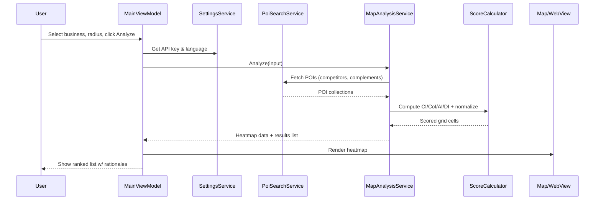
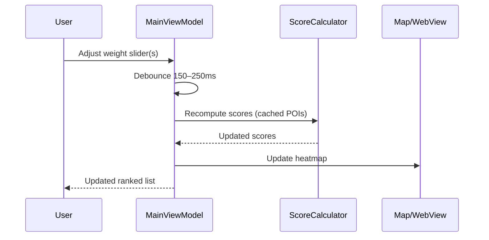

# 8. Core Workflows

## 8.1 Analyze Flow (Sequence)

## 8.2 Weight Change Flow

## 8.3 Export Flows
- **PNG/JPG Map-only:** snapshot WebView + overlay mask (no list).  
- **PDF Results:** list with per-item map preview and rationale bullets.

---
