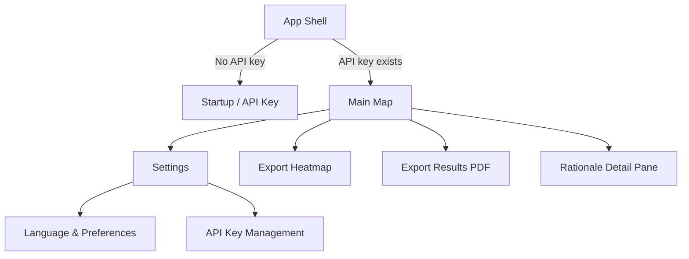
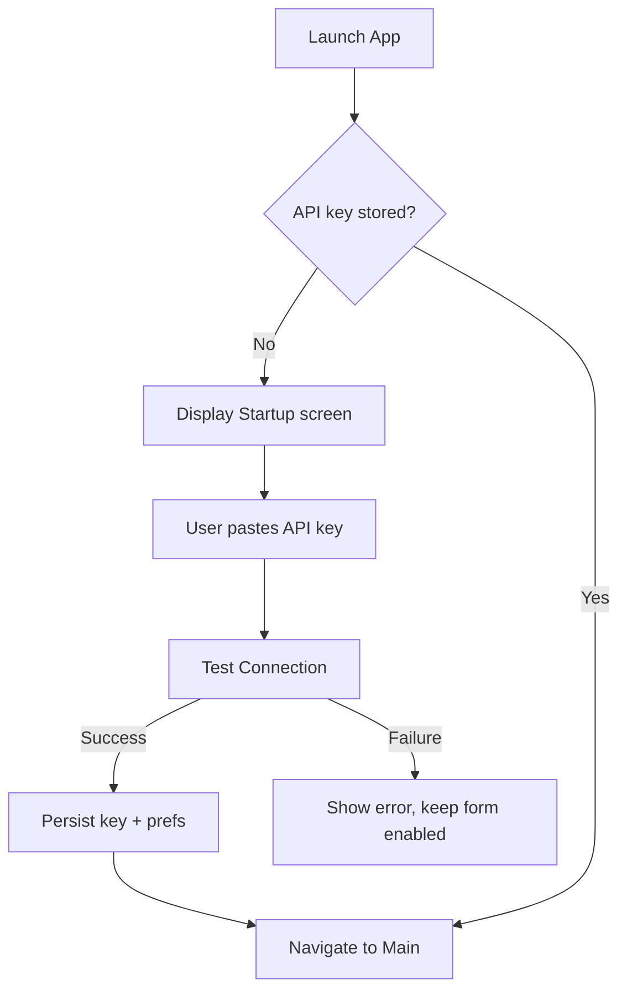
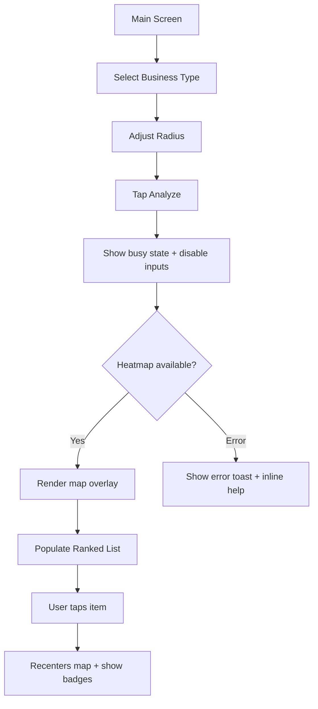
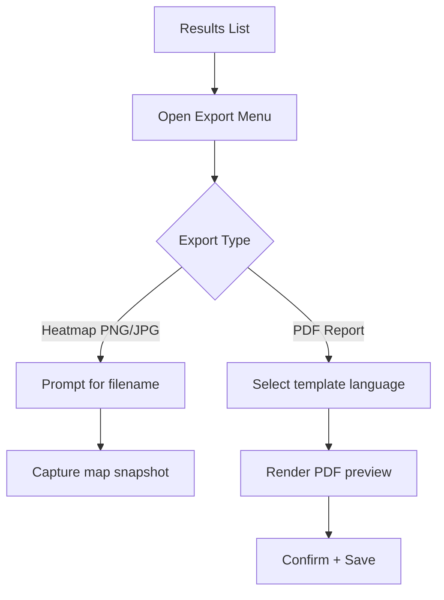
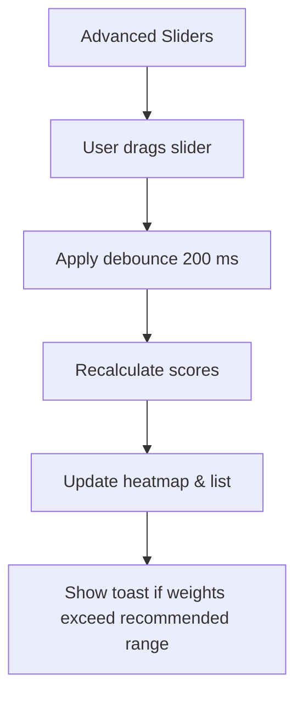

# VenueIQ UI/UX Specification

> Environment Constraint: WSL + MAUI
>
> This workspace runs in WSL. While `dotnet` is present, .NET MAUI build/run/test is not available here. Designers and implementation agents should focus on specifications and code; validation will be performed by the maintainer on a proper MAUI host.

## 1. Purpose
This specification translates VenueIQ's product requirements into actionable, user-centered guidance for designers and frontend developers. It complements `docs/ui-architecture.md` by focusing on the user experience: personas, information architecture, task flows, interaction patterns, visual treatment, accessibility, and responsive behaviors.

## 2. Personas & Context
- **Entrepreneur (Primary)**
  - Solo founder evaluating potential storefront locations.
  - Limited technical background, relies on clear visuals and guided workflows.
  - Needs quick way to compare multiple neighborhoods and justify decisions to partners.
- **Franchise Development Manager (Power User)**
  - Works with multiple brands; evaluates several candidate locations weekly.
  - Expects bulk efficiency, reusable preferences, exportable evidence for stakeholders.
  - Comfortable interpreting heatmaps and adjusting weighting models.
- **Real Estate Consultant (Analyst)**
  - Advises clients buying or leasing commercial space.
  - Needs bilingual output for clients, values explainable scoring and printable reports.

### 2.1 Usage Scenarios
- First-time setup: install app, enter API key, validate connectivity before first analysis.
- Rapid evaluation: run multiple analyses by switching business types and radii without re-entering data.
- Deep dive: adjust weighting sliders, inspect rationale for a specific location, export PDF report.
- Client-facing delivery: generate bilingual prints with maps and explanations.

## 3. Experience Goals & Principles
- **Usability Goals**
  - First successful analysis can be completed within 3 guided steps (<5 minutes).
  - Heatmap renders within 10 seconds of tapping Analyze (matches PRD metric).
  - All critical actions reachable with ≤2 taps/clicks from the main map screen.
  - Provide explicit validation feedback for API key and export operations.
- **Design Principles**
  1. **Clarity over complexity** – Prioritize legible data overlays and plain-language rationale.
  2. **Progressive control** – Surface advanced weighting, filters, and export options only when needed.
  3. **Explain every score** – Pair every ranked suggestion with badges and textual justification.
  4. **Bilingual by default** – Treat Serbian Latin as primary; ensure mirrored copy exists for English.
  5. **Confidence through feedback** – Immediate, contextually appropriate responses for all interactions.

## 4. Information Architecture

**Navigation Model**
- **Primary:** Shell navigation between Startup, Main, Settings.
- **Secondary:** Within Main, tabs/accordions for Advanced Weights and Results list sorting.
- **Back Navigation:** Platform native (hardware back, window close) plus explicit Close buttons on modal dialogs.
- **Breadcrumbs:** Not required; single-level workflow.

## 5. Key User Flows

### 5.1 Initial Setup & Validation

### 5.2 Run Analysis & Review Results

### 5.3 Export Results

### 5.4 Adjust Weights & Recompute

## 6. Screen Specifications

### 6.1 Startup Screen
- Layout: centered card within vertical stack. Primary CTA “Test & Save”.
- Fields: API key entry (obscured), optional hyperlink to Azure Maps documentation.
- States: idle, validating (spinner + disabled form), success (green banner + Continue), error (inline message with retry).
- Copy defaults are Serbian with English translation toggled by language switch.

### 6.2 Main Analysis Screen
- Header bar: business type Picker, radius Slider (with tooltip for km value), Analyze button.
- Secondary bar: toggle/Expander for Advanced Weights (Competition, Demand, Accessibility, Complements). Each slider shows current percentage and lock icon for auto-balance.
- Content grid:
  - **Left (map):** WebView with Azure Maps heatmap layer, pinch/zoom support, legend toggle, overlay for loading state.
  - **Right (results):** Ranked list (CollectionView) of top suggestions with score pill, badge row, description. Includes search field to filter addresses, sort dropdown (score, demand, accessibility).
- Map/list interactions: selecting list item drops highlight pin, reveals popover with distance metrics; map tap highlights corresponding list row.
- Empty state: illustrated panel instructing to choose business type and run analysis.

### 6.3 Settings Screen
- Sections: API Key management (re-test button, masked value), Language toggle (radio buttons), Default preferences (radius, weight preset).
- Provide CTA to clear cached data.

### 6.4 Export Dialogs
- Heatmap export: modal with preview thumbnail, file type selection, resolution dropdown.
- PDF export: wizard-like modal (Language selection → Summary preview → Confirm). Include note about export duration.

### 6.5 Rationale Detail Pane
- When user expands a location, show accordion with sections: Competition overview, Demand drivers, Accessibility metrics, Complementary POIs. Provide bullet list of top nearby POIs with distance chips.

## 7. Component Inventory
- `PrimaryButton` (filled) & `SecondaryButton` (outlined) with consistent padding.
- `Picker` for business category; `Slider` with step labels (0.5 km granularity).
- `WeightSlider` composite with label, value badge, tooltip explaining impact.
- `ResultCard` with rank number, score pill, badges (icons for competition, complements, transit, demand).
- `Badge` styles: info (blue), warning (amber when high competition), success (green).
- `Toast` notifications for actions (analysis complete, export success/failure).

## 8. States & Feedback
- **Loading:** overlay with spinner over map; disable Primary button; keep list ghosted.
- **Empty:** onboarding message + illustration until first analysis.
- **Partial Data:** if some POI categories missing, show banner explaining limited data.
- **Error:** map overlay with retry CTA; toast explaining issue and link to troubleshooting.
- **Success:** subtle toast “Analysis refreshed” after recomputation; highlight first list item.

## 9. Localization Guidelines
- Maintain string keys consistent with `Resources/Strings/*.resx`.
- Provide bilingual copy for labels, tooltips, help text, export templates.
- Format numbers with locale-specific decimal separators.
- Default language detection: use stored preference, fallback to Serbian Latin.
- Assets (icons, diagrams) must be language-neutral; avoid embedded text in images where possible.

## 10. Accessibility Checklist
- Target WCAG 2.1 AA.
- Minimum contrast 4.5:1 for text, 3:1 for large icons.
- All actionable elements require visible focus state (1.5px outline using accent color).
- Touch targets ≥48x48 dp on mobile.
- Provide `SemanticProperties.Description` for map, result cards, sliders, and export actions.
- Keyboard navigation: ensure tab order flows header → advanced controls → map → list.
- Announce live updates (e.g., results refreshed) via polite accessibility notifications.

## 11. Responsive & Adaptive Behavior
- Breakpoints:
  - **Mobile:** <640px – stack map above results; sliders become collapsible cards.
  - **Tablet:** 641-1024px – split panes 60/40, show advanced weights in collapsible column.
  - **Desktop:** 1025-1440px – grid 2/3 map, 1/3 list; weights persist expanded.
  - **Wide Desktop:** >1440px – add left margin gutter, center content, allow expanded detail panel.
- Orientation: support portrait/landscape with responsive grid; in landscape, show map + list side-by-side even on tablets.
- Input adaptation: increase hover tooltips on desktop, long-press interactions on touch devices.

## 12. Visual Style Guide
- **Color Palette**
  - Primary: `#1B4965`
  - Secondary: `#5FA8D3`
  - Accent: `#FFD166`
  - Neutral Dark: `#1F2933`
  - Neutral Light: `#F5F7FA`
  - Success: `#2E8540`
  - Warning: `#C05621`
  - Error: `#C53030`
- **Typography**
  - Headings: `Montserrat` (semi-bold 600)
  - Body: `Source Sans Pro`
  - Numeric badges: monospaced `Roboto Mono`
  - Sizes: H1 28pt/36, H2 22pt/30, Body 16pt/24, Small 14pt/20.
- **Iconography**
  - Fluent or Segoe UI symbol set for alignment with Windows + MAUI style.
  - Weight slider icons: competition (target), demand (arrow up), accessibility (transit), complements (handshake).
- **Spacing**
  - Base unit 8px; maintain multiples (16, 24, 32).
  - Map/list gutter minimum 24px on desktop, 16px on mobile.

## 13. Micro-interactions
- Weight slider value snaps with easing `CubicOut` over 180ms.
- Analyze button ripple/haptic feedback on mobile.
- Toasts fade in/out over 150ms, auto-dismiss after 3s.
- Results list item expansion animated height transition 200ms.
- Map location highlight pulses (alpha fade) for 1s when selected.

## 14. Performance Considerations
- Preload map tiles while user reviews settings (show skeleton overlay).
- Cache last analysis response for quick toggling between languages.
- Debounce slider changes to reduce API churn; show “Updating…” micro-label near sliders.
- Limit result list to top 25 by default; offer “Load more” if dense area detected.
- Exports should run off UI thread; present progress indicator inside modal.

## 15. Data, Errors & Edge Cases
- API Key invalid: present inline error, do not clear field; provide link to regenerate key.
- No POIs returned: display informative empty state with suggestions (increase radius, broaden category).
- Azure Maps quota exceeded: show banner with next reset time estimate.
- Offline mode: detect connectivity loss and queue analysis until reconnection; grey out Analyze button.
- Export failure: keep dialog open with error summary; allow retry without reconfiguring options.

## 16. QA & Validation
- Collaborative QA with Test Architect to cover bilingual, accessibility, map interactions.
- Automated UI smoke tests must validate:
  1. API key entry/validation
  2. Analysis run + heatmap render
  3. Weight adjustment recomputation
  4. Export flows (mocked file system)
  5. Language toggle persistence
- Manual checklist to include assistive tech pass (screen reader, keyboard-only) and contrast verification.

## 17. Handoff & Next Steps
1. Review this specification with Product Owner and Dev lead; incorporate feedback.
2. Produce mid-fidelity wireframes in Figma illustrating core states (startup, main, exports, errors).
3. Define localized copy deck (Serbian + English) for UI labels and help text.
4. Align component library tokens with MAUI resource dictionaries.
5. Schedule usability validation session with representative entrepreneur user.

**Design Handoff Checklist**
- [x] User flows documented
- [x] Component inventory defined
- [x] Accessibility requirements explicit
- [x] Responsive strategy captured
- [x] Brand guidelines embedded
- [x] Performance expectations noted

## 18. Change Log
| Date | Version | Description | Author |
|---|---|---|---|
| 2025-10-07 | 0.1 | Initial UI/UX specification | Sally (UX Expert) |

---
