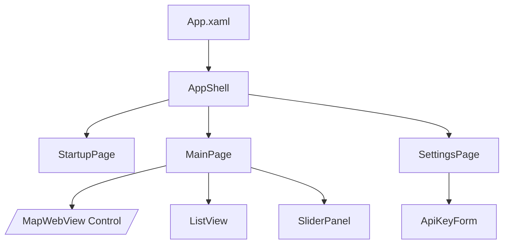
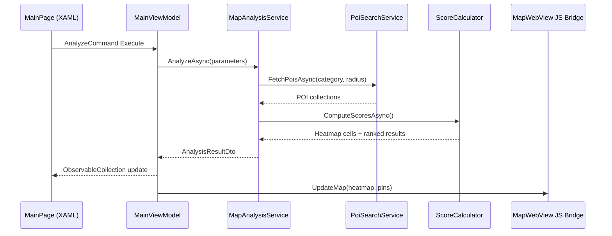

# VenueIQ Frontend Architecture

## 1. Purpose & Scope
VenueIQ is a bilingual (.NET MAUI) mobile + desktop client that surfaces optimal business locations in Serbia. This document expands on the system architecture by detailing UI concerns: screen composition, navigation, MVVM patterns, localization, styling, Azure Maps embedding, and development standards for MAUI developers and automation agents. Pair this with `docs/front-end-spec.md` for UX/visual guidance.

## 2. Context & Assumptions
- **Project Type:** Greenfield MAUI application; single repository.
- **Primary Users:** Small business owners, franchise managers, real-estate professionals.
- **Runtime Platforms:** Android, iOS, Windows, macOS using .net 9 MAUI single project.
- **Data Source:** Azure Maps REST APIs (Search, POI categories) rendered via WebView-hosted Azure Maps Web control.
- **Internal Patterns:** MVVM with dependency injection via `MauiProgram`.
- **Localization:** Serbian Latin (`sr-Latn`) default; English toggle through RESX resources.

> Environment Constraint: WSL + MAUI
>
> This workspace runs under WSL. `dotnet` is present, but .NET MAUI projects cannot be built, launched, or UI-tested here. Agents should implement code and update docs only; the maintainer will build and test on a supported MAUI host and relay results.

## 3. UI Technology Stack
| Category | Technology | Version | Purpose | Rationale |
|---|---|---|---|---|
| Framework | .NET MAUI | 9.0.x | Cross-platform UI layer | Single codebase spanning mobile + desktop.
| UI Markup | XAML | n/a | Declarative page/layout definitions | Native MAUI layouting, data binding support.
| MVVM Toolkit | CommunityToolkit.Mvvm | latest | Source generators for INotifyPropertyChanged | Reduces boilerplate, recommended by MAUI team.
| Mapping | Azure Maps Web Control (WebView) | latest | Heatmap + dynamic map overlays | Mature JS SDK with heatmap support unavailable natively in MAUI.
| HTTP | `System.Net.Http.HttpClient` | latest | REST calls to Azure Maps APIs | Built-in, DI-friendly.
| Serialization | `System.Text.Json` | latest | POI DTO serialization | High performance, included in BCL.
| State Persistence | `SecureStorage`, `Preferences` | n/a | Persist API key & preferences | Platform abstraction built into MAUI.
| PDF Export | QuestPDF or Syncfusion.Pdf | latest | Generate results report | Chosen per licensing availability.
| Testing | xUnit + .NET MAUI Test Harness | latest | ViewModel/unit tests & cross-platform UI tests | Aligns with broader architecture test strategy.
| Analytics (future) | App Center / Azure App Insights | TBC | Usage & crash reporting | Optional post-MVP addition.

## 4. Application Structure

### 4.1 Directory Layout
```text
VenueIQ/
├── App.xaml(.cs)                 # Global resources, Shell registration
├── MauiProgram.cs                # DI registrations
├── Resources/
│   ├── Styles/                   # App.xaml merged dictionaries
│   ├── Strings/
│   │   ├── AppResources.resx
│   │   └── AppResources.sr-Latn.resx
│   └── Fonts/                    # Custom fonts (optional)
├── Assets/
│   └── categories.serbia.json    # POI category map
├── Controls/
│   └── MapWebView.xaml(.cs)      # WebView hosting Azure Maps JS bridge
├── Views/
│   ├── StartupPage.xaml(.cs)
│   ├── MainPage.xaml(.cs)
│   └── SettingsPage.xaml(.cs)
├── ViewModels/
│   ├── StartupViewModel.cs
│   ├── MainViewModel.cs
│   └── SettingsViewModel.cs
├── Services/
│   ├── SettingsService.cs
│   ├── LocalizationService.cs
│   ├── PoiSearchService.cs
│   ├── MapAnalysisService.cs
│   ├── ScoreCalculator.cs
│   └── ExportService.cs
├── Models/
│   ├── Dtos.cs                   # POI, HeatmapCell, ResultItem
│   └── Enums.cs                  # BusinessType, Badge enums
└── Platforms/                    # Default MAUI platform folders
```

### 4.2 Navigation Shell
- Use `AppShell` with tabless navigation; register Startup, Main, Settings routes.
- Navigation rules:
  - Launch flow decides between Startup (missing API key) vs Main (credentials stored).
  - Settings is a modal page accessible via Main overflow menu.
- Back navigation adheres to platform idioms (hardware back, title bar).

### 4.3 Component Overview


## 5. Screen Specifications

### 5.1 StartupPage
- Purpose: Collect API key, validate against Azure Maps, persist securely.
- Layout: `VerticalStackLayout` with branding, `Entry` (IsPassword) for key, primary `Button` for "Test & Save".
- Behaviors: Disable button during validation, show validation state (success/toast, error message).

### 5.2 MainPage
- Top `Grid` with:
  - Business type `Picker`
  - Radius `Slider`
  - `Analyze` primary button.
- Collapsible `Expander` for advanced weight sliders (Competition, Demand, Accessibility, Complements) with live labels.
- `Grid` body: left `MapWebView` (2/3 width on desktop, stacked on mobile); right `CollectionView` result list.
- Tapping result centers map (via JS interop message) and highlights row.

### 5.3 SettingsPage
- Sections: Account (API key re-entry + "Test"), Localization (language toggle), Export defaults.
- Use `RadioButton`/`Picker` for language; show current culture.

### 5.4 Shared Controls
- **ResultCard DataTemplate:** Score, rank, badges (competition/complements/transit/demand) using `Border` + icon fonts.
- **BadgeView:** Binds to `ResultBadgeViewModel`, uses `BindableLayout` for dynamic chips.

## 6. MVVM & State Management
- `CommunityToolkit.Mvvm` attributes (`[ObservableProperty]`, `[RelayCommand]`) for ViewModels.
- ViewModels are transient registrations in DI; services are singletons.
- **StartupViewModel:** Handles API key entry, test command (async, cancellation aware).
- **MainViewModel:** Holds selected business type, radius, weight sliders, analysis results. `AnalyzeCommand` orchestrates services.
- **SettingsViewModel:** Wraps persisted settings, exposes `SaveAsync` and `TestConnectionAsync` commands.
- Use `WeakReferenceMessenger` (from toolkit) for cross-VM notifications (e.g., language change).

### 6.1 Data Flow Sequence


## 7. Azure Maps Integration
- `MapWebView` inherits `WebView` and loads embedded HTML/JS asset bundling Azure Maps Web control.
- Communication via `HybridWebView` style JS bridge:
  - `EvaluateJavaScriptAsync` to push heatmap geojson and focus commands.
  - `WebView.AddWebAllowedObject` (Win) / `IHybridWebView` pattern for receiving events (e.g., map ready).
- Heatmap rendering pipeline:
  1. Convert normalized grid cells to GeoJSON FeatureCollection.
  2. Inject via `atlas.source.DataSource` + `atlas.layer.HeatMapLayer`.
  3. Use gradient consistent with brand palette.
- Ensure WebView uses `WKWebView` (iOS/macOS) and `EdgeWebView2` (Win) with hardware acceleration toggles.

## 8. Localization & Globalization
- `LocalizationService` sets `CultureInfo` globally (`CultureInfo.DefaultThreadCurrentUICulture`).
- Store resources in `Resources/Strings/AppResources*.resx`.
- Use `{x:Static localization:AppResources.SomeKey}` for compile-time binding or `LocalizationResourceManager` for runtime-to-XAML `Binding` to dynamic resources.
- Provide extension method `Translated` for `Binding` convenience.
- Testing: ensure both languages cover UI strings; baseline string keys referenced in docs.

## 9. Styling & Theming
- Define color palette in `Resources/Styles/Colors.xaml` with light/dark dictionaries.
- Base typography in `Resources/Styles/Typography.xaml` mapping to MAUI `FontSize` resources.
- Global styles for `Button`, `Entry`, `Slider`, `CollectionView` to unify look.
- Map overlays should reuse brand palette: heatmap gradient `[ #1B4965, #5FA8D3, #BEE9E8, #FFD166 ]`.
- Use `VisualStateManager` for responsiveness (e.g., `Narrow`, `Wide` states adjusting layout columns).

## 10. Accessibility Guidelines
- Provide `AutomationId` for interactive controls to support UI tests & accessibility.
- Ensure sufficient contrast (WCAG AA). Use dynamic resource adjustments for dark mode.
- Support larger font settings by binding to `AppThemeBinding` and using `SemanticProperties.Description` for key controls.
- Provide haptic feedback/snackbars for critical actions on mobile.

## 11. Testing Strategy
- **ViewModel Tests:** xUnit + FluentAssertions; mock services via `Moq` or `NSubstitute`.
- **Behavior Tests:** Use `CommunityToolkit.Maui.Markup.UnitTests` for data binding verification.
- **UI Tests:** .NET MAUI UITest (WinUI/Android) for startup flow, analyze flow, language switch.
- **WebView Contract Tests:** Integration tests for JavaScript bridge using `Playwright`-driven WebView host or platform-specific harness.
- Minimum coverage: 80% ViewModel logic; smoke UI scenarios automated per platform weekly.

## 12. Environment & Configuration
- `AppConstants.cs` holds defaults (radius, debounce ms, default weights).
- Required preferences/secrets:
  - `SecureStorage.GetAsync("azureMapsApiKey")`
  - `Preferences.Get("language", "sr-Latn")`
  - `Preferences.Get("lastRadius", 2.0)`
- Provide `appsettings.Development.json` equivalent not required; rely on typed constants and services.
- Build configuration toggles (Debug/Release) manage logging verbosity and WebView debugging.

## 13. Developer Workflow & Standards
- Use `dotnet workload install maui` before development.
- Preferred commands:
  - `dotnet build -t:Run -f net9.0-android`
  - `dotnet build -t:Run -f net9.0-windows10.0.19041.0`
  - `dotnet test`
- Coding rules:
  - Follow MVVM separation; no business logic in code-behind except view-only adjustments.
  - Commands must guard against concurrent execution (`IsBusy` flag or toolkit `IAsyncRelayCommand`).
  - Always use `ObservableCollection` for UI lists; updates on main thread.
  - All string literals user-facing must come from RESX resources.
  - Weight sliders share a single `WeightsViewModel` to simplify debounced updates.
- Pull Requests should include screenshots (mobile + desktop) and capture map render flush.

## 14. Open Questions / Future Enhancements
- Investigate caching of POIs for offline reuse while respecting Azure Maps terms.
- Consider dedicated `AnalysisResultDetailPage` if rationale grows.
- Evaluate using `SkiaSharp` overlay for heatmap as fallback to WebView on restricted platforms.
- Explore pipeline for exporting localized PDF (Serbian + English sections).

## 15. Change Log
| Date | Version | Description | Author |
|---|---|---|---|
| 2025-10-07 | 0.1 | Initial front-end architecture draft | Winston (Architect) |

---
